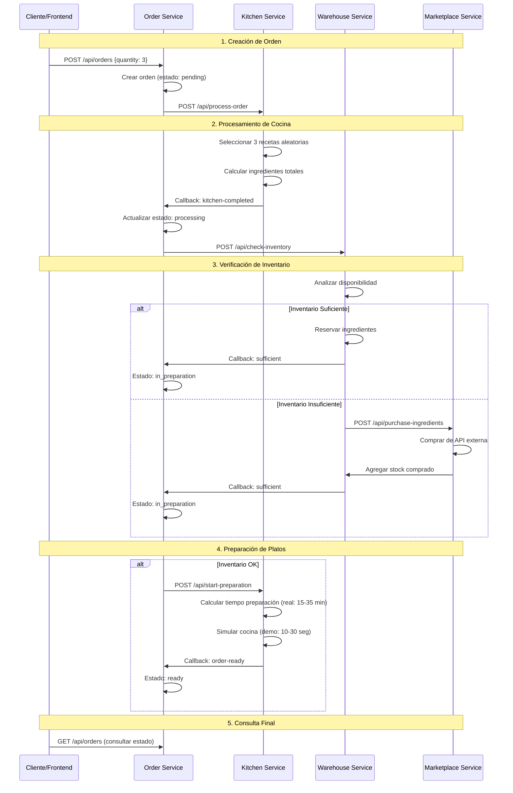

# 🍽️ Sistema de Restaurante - Arquitectura de Microservicios

## 📋 Descripción General

Este es un sistema completo de gestión de restaurante construido con **arquitectura de microservicios**. El sistema permite a los clientes realizar órdenes, gestiona el inventario de ingredientes, coordina la preparación en cocina, y maneja la compra automática de ingredientes faltantes desde proveedores externos.

## 🏗️ Arquitectura del Sistema

### Vista de Alto Nivel

```
┌─────────────────┐    ┌──────────────────────────────────────────┐
│                 │    │              MICROSERVICIOS              │
│   FRONTEND      │    │                                          │
│   (Vue.js)      │────┤  ┌─────────┐ ┌─────────┐ ┌─────────┐   │
│                 │    │  │ Kitchen │ │ Order   │ │Warehouse│   │
│                 │    │  │Service  │ │Service  │ │Service  │   │
└─────────────────┘    │  └─────────┘ └─────────┘ └─────────┘   │
                       │              ┌─────────┐               │
                       │              │Marketplace               │
                       │              │Service  │               │
                       │              └─────────┘               │
                       └──────────────────────────────────────────┘
                                         │
                       ┌──────────────────────────────────────────┐
                       │            INFRAESTRUCTURA              │
                       │                                          │
                       │  ┌─────────┐ ┌─────────┐ ┌─────────┐   │
                       │  │DynamoDB │ │AWS      │ │External │   │
                       │  │         │ │Lambda   │ │APIs     │   │
                       │  └─────────┘ └─────────┘ └─────────┘   │
                       └──────────────────────────────────────────┘
```

## 🔧 Componentes del Sistema

### 1. 🍳 Kitchen Service
**Responsabilidad:** Gestión de recetas, procesamiento de órdenes y preparación de platos

**Funcionalidades clave:**
- Catálogo de 6 recetas predefinidas con ingredientes específicos
- Selección aleatoria de recetas según cantidad solicitada
- Cálculo automático de ingredientes necesarios
- **Simulación de preparación** con tiempos realistas basados en recetas
- **Notificación automática** cuando platos están listos para entrega
- Comunicación bidireccional con Order Service

**Base de datos:** Recetas hardcodeadas (6 platos: Pizza, Ensalada, Pollo, Hamburguesa, etc.)

[Ver documentación detallada →](kitchen-service/README.md)

### 2. 📋 Order Service ⭐ (Servicio Central)
**Responsabilidad:** Orquestación completa del flujo de órdenes

**Funcionalidades clave:**
- **API REST** para crear y consultar órdenes
- **Gestión de estados** de órdenes (8 estados diferentes)
- **Coordinación entre servicios** via callbacks HTTP
- **Manejo de errores** y recuperación automática

**Estados de orden:**
- `pending` → `processing` → `in_preparation` → `ready` → `delivered`
- Estados de error: `failed`, `waiting_marketplace`, `failed_unavailable_ingredients`

**Base de datos:** DynamoDB (`restaurant-orders-dev`)

[Ver documentación detallada →](order-service/README.md)

### 3. 🏪 Warehouse Service  
**Responsabilidad:** Gestión completa del inventario

**Funcionalidades clave:**
- **Inventario de 13 ingredientes** con cantidades iniciales
- **Sistema de reservas** para órdenes activas  
- **Verificación inteligente** de disponibilidad
- **Integración con Marketplace** para compras automáticas
- **Gestión de stock** (agregar, consumir, reservar)

**Ingredientes gestionados:**
- Disponibles en marketplace externo: `tomato`, `cheese`, `onion`, `lettuce`, `meat`, `chicken`, `rice`, `lemon`, `potato`, `ketchup`
- Solo en inventario interno: `flour`, `olive_oil`, `croutons`

**Base de datos:** DynamoDB (`restaurant-inventory-dev`)

[Ver documentación detallada →](warehouse-service/README.md)

### 4. 🛒 Marketplace Service
**Responsabilidad:** Compra de ingredientes desde proveedores externos

**Funcionalidades clave:**
- **Integración con API externa** (Farmers Market)
- **Sistema de reintentos** con exponential backoff
- **Circuit breaker** para APIs no disponibles
- **Gestión de costos** y historial de compras
- **Compras parciales** inteligentes

**API Externa:** `https://recruitment.alegra.com/api/farmers-market/buy`

**Base de datos:** Cache en memoria para historial de compras

[Ver documentación detallada →](marketplace-service/README.md)

### 5. 🖥️ Restaurant Frontend
**Responsabilidad:** Interfaz de usuario para gestión del restaurante

**Funcionalidades:**
- Dashboard con métricas en tiempo real
- Gestión de órdenes (crear, consultar, filtrar)
- Monitoreo de inventario
- Historial de compras
- Estado del sistema

**Tecnología:** Vue.js + Tailwind CSS

## 🔄 Flujo Completo del Sistema

### Flujo Exitoso Típico



### Flujo Detallado por Fases

#### **Fase 1: Creación de Orden**
- Cliente/Frontend → `POST /api/orders`
- Order Service crea orden con estado `pending`
- Dispara Kitchen Service automáticamente

#### **Fase 2: Procesamiento de Recetas**  
- Kitchen Service selecciona recetas aleatorias
- Calcula ingredientes totales necesarios
- Notifica Order Service → estado `processing`
- Dispara Warehouse Service para verificación

#### **Fase 3: Verificación de Inventario**
- Warehouse analiza disponibilidad de ingredientes
- **Si suficiente**: Reserva ingredientes → estado `in_preparation`
- **Si insuficiente**: Compra en Marketplace → eventual `in_preparation`
- **Si no disponible**: Estado `failed_unavailable_ingredients`

#### **Fase 4: Preparación de Platos** ⭐ (Nueva)
- Order Service dispara Kitchen Service cuando estado = `in_preparation`
- Kitchen calcula tiempo total basado en recetas (15-35 min reales)
- Simula preparación: 
  - **Demo**: 10-30 segundos para prueba técnica
  - **Producción**: Tiempo real de cocina (15-35 min)
- Kitchen notifica automáticamente cuando platos están listos
- Order Service → estado `ready`

#### **Fase 5: Entrega**
- Orden disponible para entrega (estado `ready`)
- Sistema puede marcar como `delivered` manualmente

### Escenarios de Error

#### 1. **Ingredientes No Disponibles**
```
Warehouse detecta falta de ingredientes
        ↓
Marketplace verifica disponibilidad externa  
        ↓
Ingredientes como 'flour', 'olive_oil' NO están en API externa
        ↓
Estado final: failed_unavailable_ingredients
```

#### 2. **Fallo de Comunicación**
```
Timeout en llamada entre servicios
        ↓
Sistema implementa reintentos automáticos
        ↓
Si fallan todos los reintentos → Estado: failed
        ↓
Logs detallados para debugging
```

## 🗄️ Arquitectura de Datos

### Tablas Principales

#### 1. Orders (DynamoDB)
```
restaurant-orders-dev
├── id (PK)                    # UUID
├── order_number              # ORD-XXXXXXXX
├── status                    # Estados de la orden
├── selected_recipes (JSON)   # Recetas seleccionadas
├── required_ingredients (JSON) # Ingredientes calculados
└── ... otros campos
```

#### 2. Inventory (DynamoDB)  
```
restaurant-inventory-dev
├── ingredient (PK)           # Nombre del ingrediente
├── quantity                  # Cantidad total
├── reserved_quantity        # Cantidad reservada
├── unit                     # kg, liters, etc.
└── last_updated             # Timestamp
```

### Consistencia de Datos

- **Consistencia eventual** en DynamoDB
- **Transacciones compensatorias** para rollback de reservas
- **Idempotencia** en operaciones críticas
- **Logs auditables** para trazabilidad completa

## 🌐 Comunicación Entre Servicios

### Protocolo de Comunicación
- **HTTP REST** para todas las comunicaciones
- **Callbacks asíncronos** para notificaciones
- **Timeouts configurables** (30-60 segundos)
- **Reintentos automáticos** con exponential backoff

### Endpoints de Callback
```
Order Service recibe:
├── POST /api/callbacks/kitchen-completed      # Desde Kitchen
├── POST /api/callbacks/warehouse-completed    # Desde Warehouse  
└── POST /api/callbacks/marketplace-completed  # Desde Marketplace

Warehouse Service recibe:
└── POST /api/add-stock                        # Desde Marketplace
```

### Variables de Entorno Críticas
```env
# URLs de servicios (cada servicio conoce a los demás)
KITCHEN_SERVICE_URL=https://kitchen-service-url
ORDER_SERVICE_URL=https://order-service-url
WAREHOUSE_SERVICE_URL=https://warehouse-service-url
MARKETPLACE_SERVICE_URL=https://marketplace-service-url

# Configuración AWS
AWS_DEFAULT_REGION=us-east-1
```

## 🔧 Particularidades Técnicas

### 1. **Gestión de Estados Distribuida**
- **Sin base de datos compartida** entre servicios
- **Estados locales** gestionados independientemente  
- **Eventual consistency** entre servicios
- **Compensating transactions** para rollbacks

### 2. **Manejo de Fallos**
- **Circuit breaker** en Marketplace Service
- **Graceful degradation** en caso de fallos parciales
- **Estados de error específicos** para diferentes tipos de falla
- **Recovery automático** cuando servicios se recuperan

### 3. **Escalabilidad**
- **Serverless** con AWS Lambda
- **Auto-scaling** basado en demanda
- **Stateless services** para escalabilidad horizontal
- **Cache distribuido** para optimización

### 4. **Monitoreo y Observabilidad**
- **Logs estructurados** en todos los servicios
- **Correlation IDs** para trazabilidad de requests
- **Métricas de negocio** (órdenes/minuto, éxito/fallo)
- **Health checks** automáticos

## 🚀 Despliegue y Operación

### Tecnologías Utilizadas
- **Backend:** Laravel 11 + PHP 8.2
- **Frontend:** Vue.js 3 + Tailwind CSS
- **Infraestructura:** AWS Lambda + DynamoDB
- **Deployment:** Serverless Framework
- **APIs:** REST + Callbacks HTTP

### Entornos
- **Development:** Servicios locales con base de datos simulada
- **Production:** AWS Lambda + DynamoDB + API Gateway

### Scripts de Despliegue
```bash
# Desplegar todos los servicios
./deploy.sh

# Desplegar servicio específico  
cd kitchen-service && serverless deploy

# Inicializar inventario
curl -X POST https://warehouse-url/api/inventory/initialize
```

## 🧪 Testing del Sistema

### Endpoints de Testing
```http
# Test completo del flujo
POST /api/orders {"quantity": 2, "customer_name": "Test"}

# Verificar inventario
GET /api/inventory

# Test de marketplace
GET /api/test-connection

# Consultar estado de órdenes
GET /api/orders/status/pending
```

### Casos de Prueba Principales
1. **Flujo exitoso completo** (pending → processing → in_preparation → ready)
2. **Falta de inventario** (activar marketplace automáticamente)
3. **Ingredientes no disponibles** (fallar con estado específico)
4. **Preparación de platos** (verificar tiempos y callback automático)
5. **Fallos de comunicación** (reintentos y recovery)
6. **Carga alta** (múltiples órdenes simultáneas)

### Verificación del Flujo Completo
```http
# 1. Crear orden
POST /api/orders {"quantity": 2, "customer_name": "Test"}
→ Respuesta: {"data": {"id": "uuid", "status": "pending"}}

# 2. Esperar procesamiento (5-10 segundos)
GET /api/orders/{uuid}
→ Esperado: "status": "processing" | "in_preparation"

# 3. Esperar preparación (10-30 segundos en demo)
GET /api/orders/{uuid}  
→ Esperado: "status": "ready"

# 4. Verificar tiempo total (debe ser ~30-60 segundos total)
```

## 🔒 Consideraciones de Seguridad

- **CORS configurado** para frontend específico
- **Rate limiting** en API Gateway
- **Validación de inputs** en todos los endpoints
- **Logs de auditoría** para todas las operaciones
- **Secrets management** para URLs de servicios

## 📊 Métricas y KPIs

### Métricas de Negocio
- **Órdenes procesadas** por hora/día
- **Tiempo promedio** de procesamiento de órdenes
- **Tasa de éxito** de órdenes (% que llegan a "ready")
- **Costo promedio** de ingredientes comprados

### Métricas Técnicas  
- **Latencia** de endpoints por servicio
- **Tasa de error** por servicio
- **Disponibilidad** de APIs externas
- **Utilización** de DynamoDB y Lambda

---

**🎯 Objetivo:** Demostrar dominio de arquitectura de microservicios, APIs REST, gestión de estado distribuido, y integración de servicios externos en un sistema de producción escalable.

