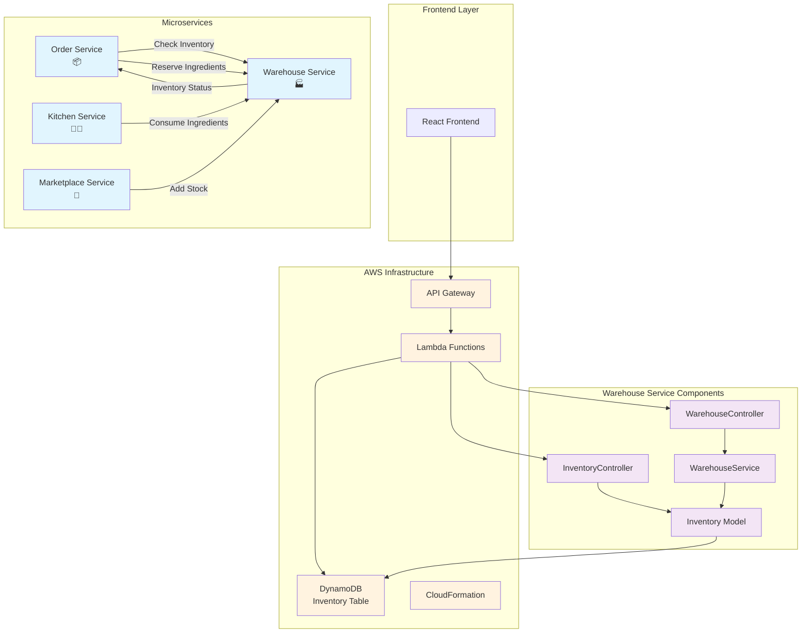
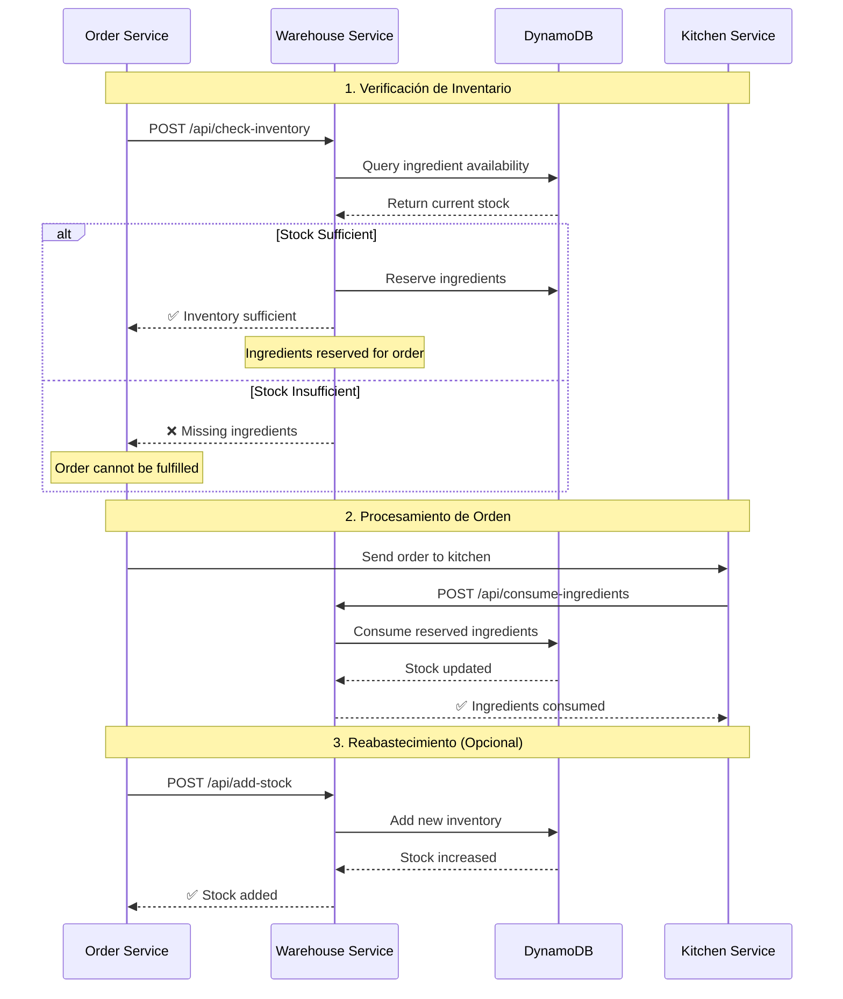

# Warehouse Service - Restaurant System 🏭

[](https://aws.amazon.com/lambda/)
[](https://php.net)
[](https://laravel.com)
[](https://aws.amazon.com/dynamodb/)
[](https://serverless.com)

## 📋 Descripción

El **Warehouse Service** es un microservicio serverless que gestiona el inventario de ingredientes del sistema de restaurante. Utiliza AWS DynamoDB para el almacenamiento persistente y AWS Lambda para el procesamiento sin servidor.

### 🎯 Funciones Principales

- **Gestión de Inventario**: Control completo de stock de ingredientes
- **Reserva de Ingredientes**: Sistema de reservas para órdenes activas
- **Verificación de Disponibilidad**: Validación de stock para nuevas órdenes
- **Notificaciones**: Comunicación con otros microservicios
- **Operaciones de Stock**: Agregar, consumir y gestionar inventario

## 🏗️ Arquitectura del Sistema



## 🔄 Flujo de Trabajo del Inventario



## 📊 Modelo de Datos

### Tabla de Inventario (DynamoDB)

```json
{
  "ingredient": "tomato",           // 🔑 Partition Key
  "quantity": 15,                  // Cantidad total disponible
  "reserved_quantity": 3,          // Cantidad reservada para órdenes
  "unit": "kg",                   // Unidad de medida
  "last_updated": "2024-01-15T10:30:00Z"
}
```

### Cantidad Disponible
```
available_quantity = quantity - reserved_quantity
```

## 🚀 API Endpoints

### 📦 Operaciones de Warehouse

| Método | Endpoint | Descripción |
|--------|----------|-------------|
| `POST` | `/api/check-inventory` | Verifica disponibilidad para una orden |
| `POST` | `/api/reserve-ingredients` | Reserva ingredientes |
| `POST` | `/api/consume-ingredients` | Consume ingredientes reservados |
| `POST` | `/api/add-stock` | Agrega stock al inventario |

### 📋 Gestión de Inventario

| Método | Endpoint | Descripción |
|--------|----------|-------------|
| `GET` | `/api/inventory` | Lista todo el inventario |
| `GET` | `/api/inventory/{ingredient}` | Obtiene detalles de un ingrediente |
| `POST` | `/api/inventory/initialize` | Inicializa inventario con stock predeterminado |
| `PUT` | `/api/inventory/{ingredient}/add-stock` | Agrega stock a ingrediente específico |
| `PUT` | `/api/inventory/{ingredient}/reserve` | Reserva stock de ingrediente específico |

## 📝 Ejemplos de Uso

### 🔍 Verificar Inventario para Orden

```bash
curl -X POST https://api.warehouse.com/api/check-inventory \
  -H "Content-Type: application/json" \
  -d '{
    "order_id": "order_123",
    "required_ingredients": {
      "tomato": 2,
      "cheese": 1,
      "meat": 1
    }
  }'
```

**Respuesta:**
```json
{
  "success": true,
  "data": {
    "sufficient": true,
    "available": {
      "tomato": 15,
      "cheese": 12,
      "meat": 15
    },
    "missing": {}
  }
}
```

### 📦 Reservar Ingredientes

```bash
curl -X POST https://api.warehouse.com/api/reserve-ingredients \
  -H "Content-Type: application/json" \
  -d '{
    "ingredients": {
      "tomato": 2,
      "cheese": 1
    }
  }'
```

### 🍽️ Consumir Ingredientes

```bash
curl -X POST https://api.warehouse.com/api/consume-ingredients \
  -H "Content-Type: application/json" \
  -d '{
    "ingredients": {
      "tomato": 2,
      "cheese": 1
    }
  }'
```

### 📊 Ver Inventario Completo

```bash
curl -X GET https://api.warehouse.com/api/inventory
```

**Respuesta:**
```json
{
  "success": true,
  "data": [
    {
      "ingredient": "tomato",
      "total_quantity": 15,
      "available_quantity": 13,
      "reserved_quantity": 2,
      "unit": "kg",
      "last_updated": "2024-01-15T10:30:00Z"
    }
  ],
  "total_items": 13
}
```

## 🎮 Ingredientes Disponibles

El sistema viene pre-configurado con estos ingredientes:

- **Ingredientes Principales**: `tomato`, `cheese`, `onion`, `lettuce`, `meat`, `chicken`, `rice`, `lemon`, `potato`
- **Ingredientes de Cocina**: `flour`, `olive_oil`, `croutons`
- **Condimentos**: `ketchup`

## ⚙️ Configuración y Despliegue

### Variables de Entorno

```yaml
# AWS Configuration
AWS_DEFAULT_REGION: us-east-1
DYNAMODB_TABLE: restaurant-inventory-dev

# Service URLs
ORDER_SERVICE_URL: https://api.order.com

# Laravel Configuration
APP_ENV: production
APP_KEY: base64:ZYNikPgxfyC/VuJ7XxJBm5rGQdP8qI5nkPMuLvGZThY=
```

### 🚀 Comandos de Despliegue

```bash
# Instalar dependencias
composer install --no-dev --optimize-autoloader

# Desplegar a AWS
serverless deploy --stage dev

# Inicializar inventario
curl -X POST https://your-api-url/api/inventory/initialize
```

### 📋 Requisitos AWS

- **Lambda Function**: Runtime PHP 8.2
- **DynamoDB Table**: `restaurant-inventory-{stage}`
- **IAM Permissions**: DynamoDB Read/Write access
- **API Gateway**: HTTP API with CORS enabled

## 🔧 Desarrollo Local

```bash
# Instalar dependencias
composer install

# Configurar variables de entorno
cp .env.example .env

# Generar clave de aplicación
php artisan key:generate

# Ejecutar tests
php artisan test
```

## 📈 Monitoreo y Logs

### CloudWatch Logs
- Todos los logs se envían automáticamente a CloudWatch
- Filtros disponibles por nivel de log (INFO, WARNING, ERROR)

### Métricas Importantes
- **Invocaciones Lambda**: Número de requests procesados
- **Duración**: Tiempo de respuesta promedio
- **Errores**: Rate de errores por endpoint
- **DynamoDB**: Read/Write capacity y throttling

## 🔒 Seguridad

- **Encriptación**: DynamoDB con SSE enabled
- **IAM Roles**: Permisos mínimos necesarios
- **CORS**: Configurado para frontend específicos
- **Backup**: Point-in-time recovery habilitado

## 🏷️ Versionado

- **Versión Actual**: 2.0.0-production
- **Database**: DynamoDB
- **Runtime**: AWS Lambda (PHP 8.2)
- **Framework**: Laravel 11.x

## 🤝 Integración con Otros Servicios

### Order Service
- Recibe notificaciones de disponibilidad de inventario
- Callback endpoint: `/api/callbacks/warehouse-completed`

### Kitchen Service
- Consume ingredientes después de preparar platos
- Usa endpoint: `/api/consume-ingredients`

### Marketplace Service
- Agrega stock desde compras externas
- Usa endpoint: `/api/add-stock`

---

**📧 Contacto**: Para soporte técnico, consultar documentación del sistema principal.

**🔗 Enlaces Útiles**:
- [AWS Lambda Documentation](https://docs.aws.amazon.com/lambda/)
- [DynamoDB Best Practices](https://docs.aws.amazon.com/amazondynamodb/latest/developerguide/best-practices.html)
- [Laravel Documentation](https://laravel.com/docs)
